# Synthetic stimuli — contact sheets

These PNGs are the parametric generators in [`audit/stimuli.py`](../../audit/stimuli.py),
rendered for visual inspection (issue #32). Each is what the ground-truth sweeps in
`python -m audit` actually measure; see [AUDIT.md §12](../../AUDIT.md#12-ground-truth-sweeps--how-well-each-measure-tracks-its-own-property)
for how well each measure tracks it.

- `null_controls.png` — the structureless and precisely-structured controls
  (`flat_grey`, `white_noise`, `smooth_noise`, `random_blobs`, `regular_grid`). A
  measure that reports high wholeness for these is not measuring wholeness.
- `sweep_<name>.png` — one sheet per generator, tiling every frame with its
  parameter underneath and titled `<generator> -> <property it isolates>`. Reading
  left to right shows the single structural quantity the sweep varies while holding
  the rest fixed.

Regenerate them (they are exactly this command's output, so a change to a generator
shows up as a changed image in the diff):

```
python -m audit.render            # writes here, docs/stimuli/
python -m audit.render <dir>      # or elsewhere
```

## Null controls

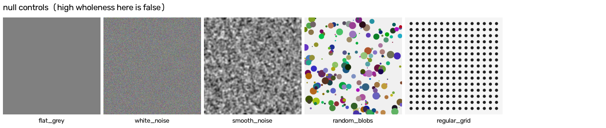

## Sweeps, in AUDIT.md §12 order

### tonal_delta → contrast

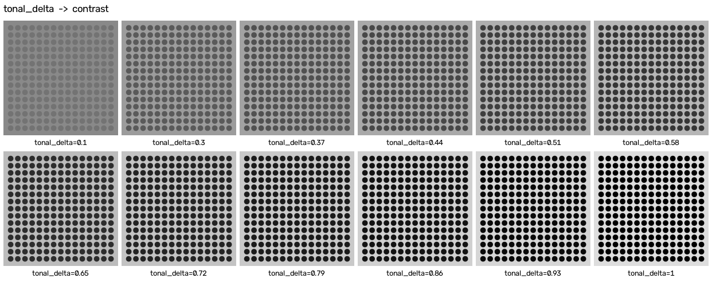

### interlock_depth → deep interlock

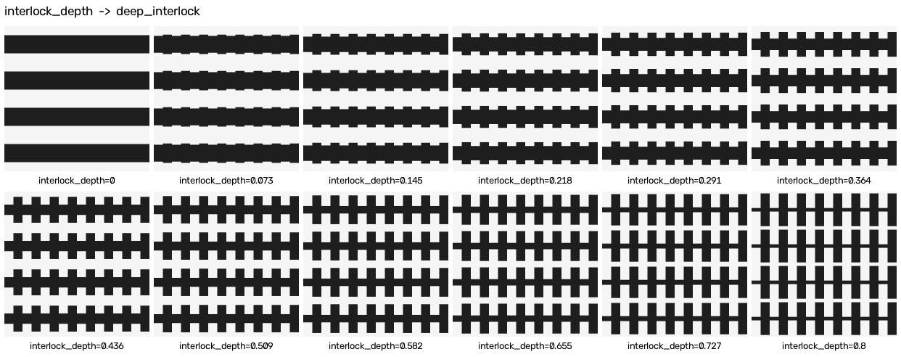

### dominance → strong centres


### zone_width → gradients

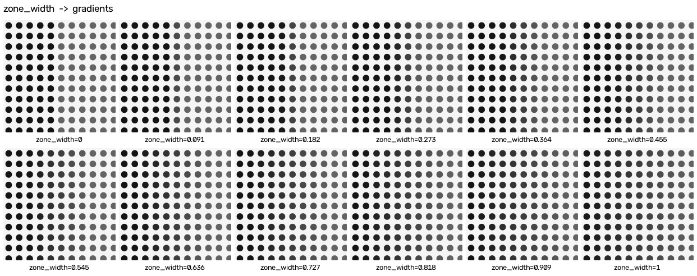

### ground_solidity → positive space

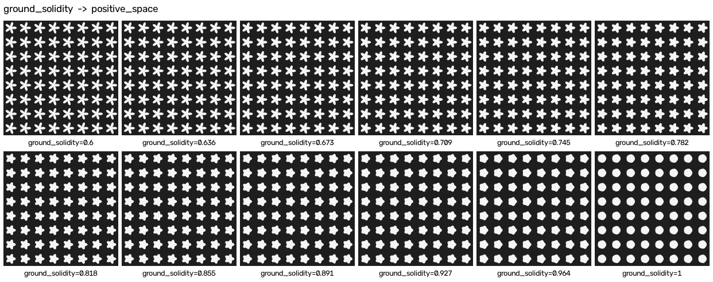

### shape_vocabulary → echoes (↓)

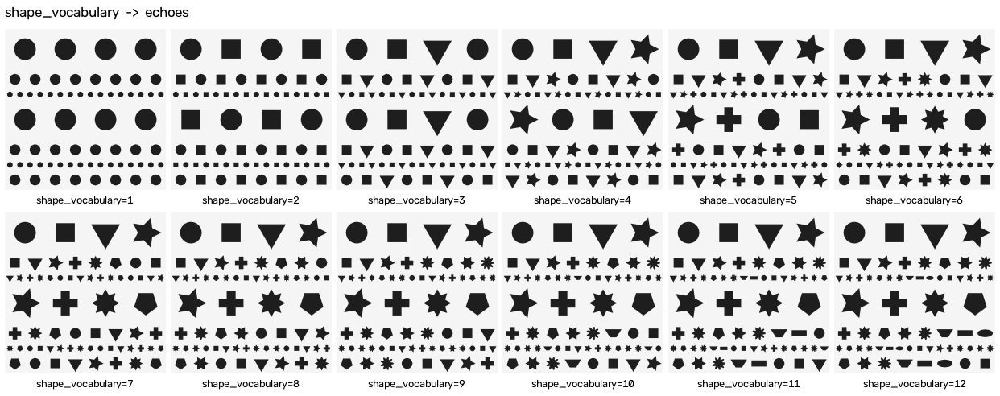

### bleed → not-separateness

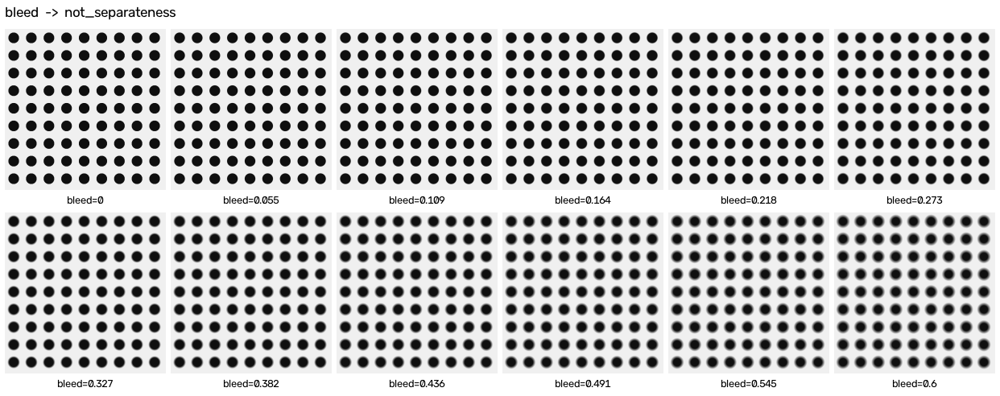

### element_kinds → simplicity

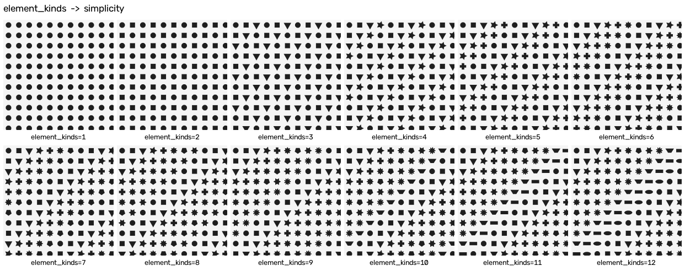

### border_band → boundaries (interior optimum at 0.3)

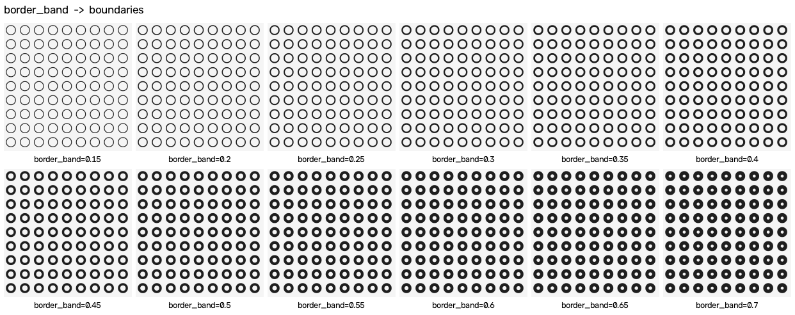

### scale_ratio → levels of scale (interior optimum at 3)

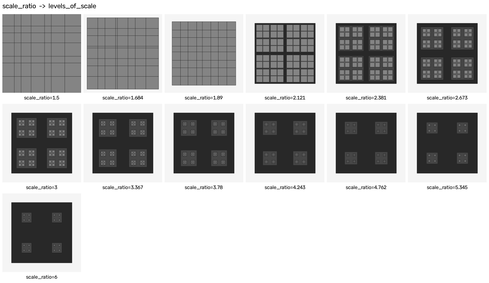

### jitter → roughness

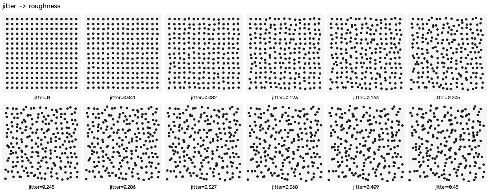

### bilateral_asymmetry → local symmetries (↓)

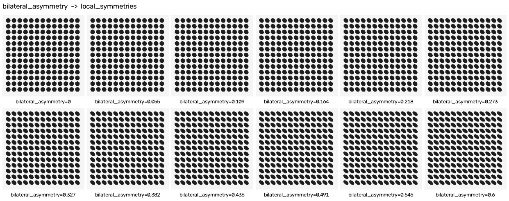

### motif_circularity → good shape


### alternation → alternating repetition

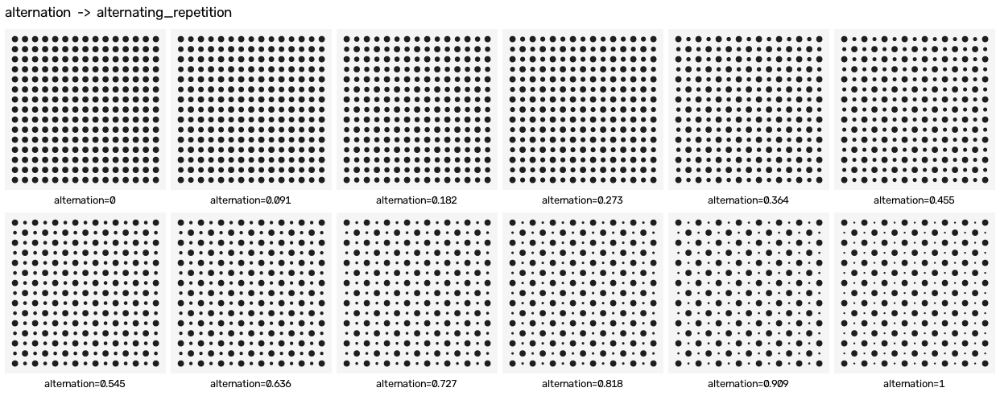

### void_size → the void

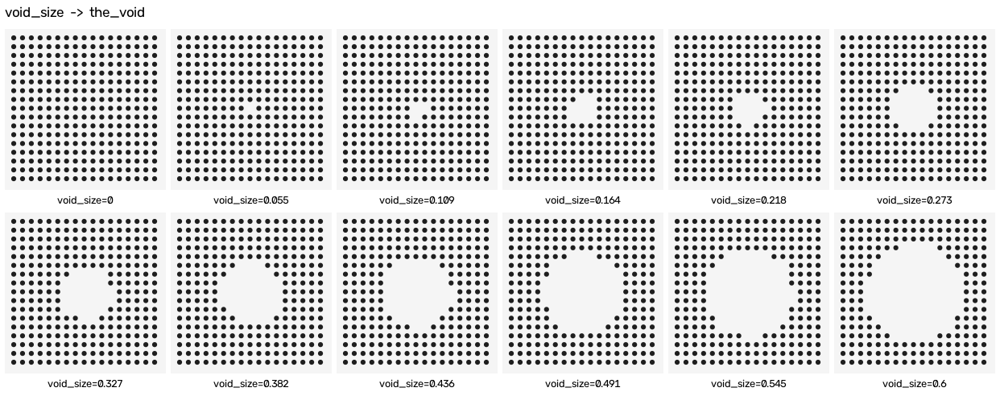
