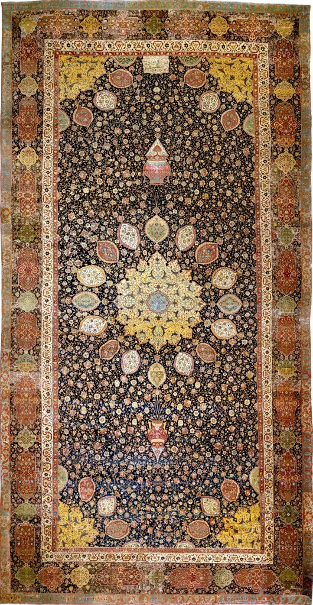
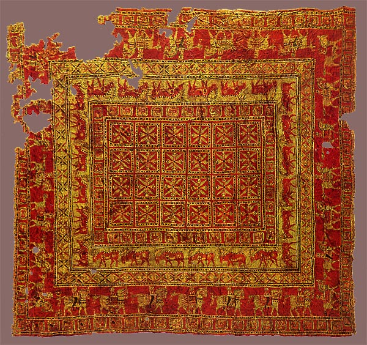
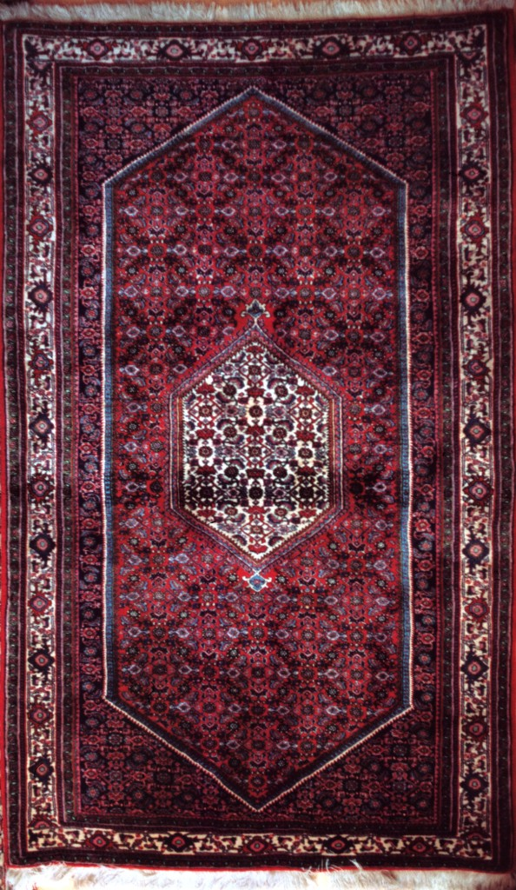
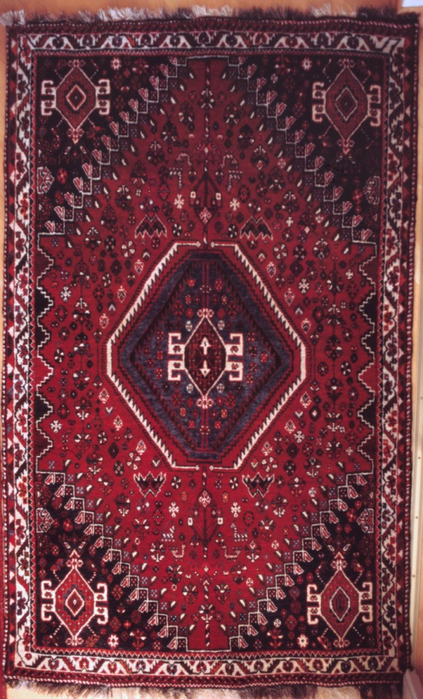
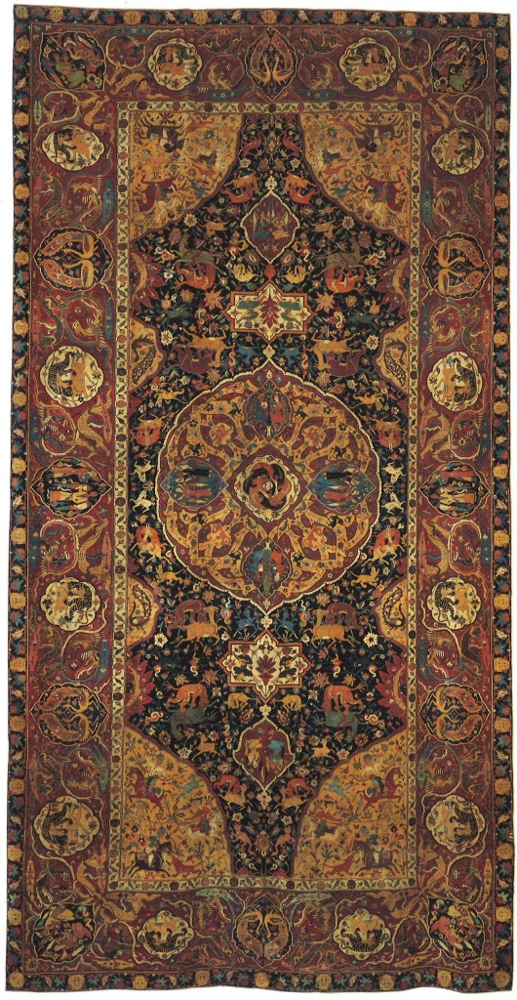
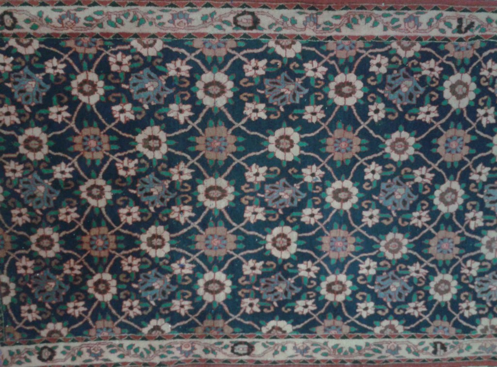

# Test images

Photographs of Persian carpets used for testing the `centres` analysis pipeline. All sourced from Wikimedia Commons and resized to a maximum of 1024 px on the longest side.

---

### Ardabil Carpet — mid-16th century, Kashan, Iran

One of the world's most celebrated carpets, completed in 1539–40 and now held at the Victoria and Albert Museum, London. The composition is dominated by a large central medallion — the famous sun disc — surrounded by a dense arabesque field and a pair of hanging mosque lamps. Its hierarchical organisation, with a single dominant focus supported by a richly articulated field, makes it a canonical example of Alexander's strong-centre structure.

*Public Domain · [Wikimedia Commons](https://commons.wikimedia.org/wiki/File:Ardabil_Carpet.jpg)*

---

### Pazyryk Carpet — 4th century BC, Central Asia

The world's oldest known pile carpet, found frozen in a Scythian burial mound in the Altai Mountains and now in the Hermitage Museum, Saint Petersburg. Its design consists of a repeating animal frieze (deer, riders on horseback) arranged in concentric border bands around a simple field. The composition is flat and highly regular — consistent with its near-uniform roughness score and the relatively open, gridded character the analysis detects.

*Public Domain · Photo: Schreiber · [Wikimedia Commons](https://commons.wikimedia.org/wiki/File:Pazyryk_carpet.jpg)*

---

### Bijar (Bidjar) Rug — 19th–20th century, Kurdistan, Iran

A finely knotted rug from the Kurdish weaving town of Bijar, known for producing the stiffest and most durable pile carpets in Persia. The design features a large central medallion on a continuous floral field. The dense, symmetrical field produces the most regular scale hierarchy of the six carpets (lowest levels-of-scale score) and the highest simplicity — a clear dominant structure with a well-articulated supporting field.

*[CC BY-SA 3.0](https://creativecommons.org/licenses/by-sa/3.0/) · BerndtF · [Wikimedia Commons](https://commons.wikimedia.org/wiki/File:Fine_Bidjar_rug.jpg)*

---

### Ghashghai (Qashqai) Rug — 19th–20th century, Fars Province, Iran

A tribal rug woven by the Qashqai confederacy of south-western Iran. Qashqai weaving is characterised by a rich, slightly irregular field of stylised animals and medallions, with bold borders. The large centre count (390) reflects the intricacy of the field, and the relatively low boundaries score indicates the dense packing of well-demarcated motif elements.

*[CC BY-SA 3.0](https://creativecommons.org/licenses/by-sa/3.0/) · Berndt Fernow · [Wikimedia Commons](https://commons.wikimedia.org/wiki/File:Ghashghai_rug.jpg)*

---

### Sanguszko Carpet — c. 1600, Kashan, Iran

A Safavid court carpet from Kashan, named after the Polish-Lithuanian noble family that once owned it, now in the Miho Museum. Its composition is dominated by a large central hunting scene medallion with relatively sparse field between the figural motifs. The analysis gives it the highest strong-centres score (3.55) of any carpet in the set and the lowest the-void score — a calm, concentrated interior — consistent with the large open field surrounding its dominant medallion.

*Public Domain · [Wikimedia Commons](https://commons.wikimedia.org/wiki/File:Sanguszko_carpet_01.jpg)*

---

### Varamin Carpet — 20th century, Varamin, Iran

A village carpet from the Varamin region south-east of Tehran. Varamin rugs are known for their dense, continuously repeating Mina Khani floral field — a pattern of interconnected flower heads and diamond lattices covering the entire ground without a central focal point. The analysis detects 1010 centres, the most of any carpet, and the highest contrast and alternating repetition scores — consistent with the strongly rhythmic, non-hierarchical field design.

*[CC BY-SA 3.0](https://creativecommons.org/licenses/by-sa/3.0/) · Pouyakhani · [Wikimedia Commons](https://commons.wikimedia.org/wiki/File:Varamin_Carpet.jpg)*

---

## License notes

Public Domain images have no restrictions on use. Images under CC BY-SA 3.0 require attribution to the author listed above and must be shared under the same licence if redistributed.

---

## Structural analysis

Results of running `centres analyse` on each image. Scores are on a 0–10 wholeness scale (10 = most present) with consistent direction — higher is always better. The raw computed value is shown alongside in `--json` output.

| Property | ardabil | pazyryk | bidjar | ghashghai | sanguszko | varamin |
|---|---:|---:|---:|---:|---:|---:|
| centres detected | 154 | 47 | 122 | 156 | 147 | 205 |
| 1 levels of scale | **5.8** | 5.6 | 5.5 | 4.9 | 5.7 | 5.7 |
| 2 strong centres | 1.9 | **4.0** | 2.6 | 2.3 | 2.5 | 2.1 |
| 3 boundaries | 5.1 | 2.7 | 4.7 | 4.7 | 4.8 | **5.6** |
| 4 alternating repetition | 6.1 | **10.0** | **10.0** | 9.9 | **10.0** | 9.5 |
| 5 positive space | **6.0** | 4.2 | 3.8 | 1.8 | 4.0 | 4.1 |
| 6 good shape | 2.9 | **5.5** | 3.3 | 2.7 | 3.4 | 2.8 |
| 7 local symmetries | 4.4 | **6.3** | 4.2 | 4.7 | 4.7 | 4.3 |
| 8 deep interlock | 0.5 | **0.8** | 0.5 | 0.5 | 0.5 | 0.4 |
| 9 contrast | 5.4 | **10.0** | 9.3 | 8.4 | 9.6 | 7.3 |
| 10 gradients | 6.9 | **8.7** | 7.2 | 6.6 | 5.9 | 8.0 |
| 11 roughness | **7.5** | 6.0 | 4.4 | 6.9 | 6.0 | 5.5 |
| 12 echoes | 3.8 | **5.3** | 5.1 | 4.6 | **5.3** | 5.1 |
| 13 the void | 6.9 | **7.7** | **7.7** | 5.6 | 7.2 | 6.9 |
| 14 simplicity | 1.3 | 0.9 | 1.1 | **1.5** | 1.2 | 1.2 |
| 15 not-separateness | 1.8 | **10.0** | **10.0** | 8.0 | 8.4 | **10.0** |

Bold marks the highest score for each property.

---

## Comparative analysis

The six carpets span roughly 2,500 years of weaving, three broad traditions (nomadic, court, and village), and a wide range of structural complexity. With the revised field construction (pre-blurred edge detection and distance cap) the analysis now detects major structural regions rather than fine texture, giving more comparable centre counts across images (47–205, versus 41–1010 previously).

### Pazyryk's unexpected dominance

The most striking result is that the **Pazyryk** — the oldest carpet in the set, from the 4th century BC — scores highest or tied-highest on nine of the fifteen properties: strong centres, alternating repetition, contrast, gradients, good shape, local symmetries, deep interlock, echoes, the void, and not-separateness. This is not a paradox: Alexander's structural properties reward clarity, contrast, and integration. The Pazyryk's simple, high-contrast border arrangement — bands of strongly defined animal figures alternating with geometric registers — produces exactly this: a small number of dominant, clearly separated centres whose spatial extents are highly similar, yielding a tight, well-connected reinforcement graph (not-separateness = 10.0). The court carpets, whose complex multi-scale compositions are visually richer, are structurally harder to read.

### Scale hierarchy and self-similarity (levels of scale, echoes)

**Ardabil** scores highest on levels of scale (5.8), meaning its parent-child pairs cluster most closely around the ideal 3:1 scale ratio. This is somewhat surprising but consistent with the Ardabil's composition: a well-articulated hierarchy from small arabesque details through medium motifs to the large central medallion. **Ghashghai** scores lowest (4.9), reflecting the relatively flat, all-over tribal field with less separation between scale levels.

Echoes — the self-similarity of scale ratios throughout the hierarchy — is highest for **Pazyryk** and **Sanguszko** (both 5.3), whose regular repeating arrangements produce a consistent scale step at every hierarchical level. All carpets score in a relatively narrow range (3.8–5.3), suggesting this property is less diagnostic across the set than others.

### Focal strength and void (strong centres, the void, simplicity)

**Pazyryk** has the highest strong-centres score (4.0), well above the others (1.9–2.6). Its bold, high-contrast border figures stand out strongly from their surroundings after reinforcement propagation — their strength is distinctive rather than shared. All carpets score low on simplicity (0.9–1.5), indicating relatively even distributions of centre strengths rather than a single dominant focal point; **Ghashghai** is marginally highest (1.5), consistent with its prominent central medallion.

**Pazyryk** and **Bidjar** share the highest the-void score (7.7), indicating a calm, low-gradient interior within the dominant centre. For the Pazyryk this is the quiet central field surrounded by the animal borders; for the Bidjar it is the open ground around the central medallion. **Ghashghai** scores lowest (5.6), whose dominant region has more internal variation.

### Boundaries and field smoothness (boundaries, gradients)

The boundaries score — how clearly adjacent centres are separated by a field trough — is highest for **Varamin** (5.6) and **Ardabil** (5.1). Their dense, interlocking motif fields create well-demarcated separating zones between detected centres. **Pazyryk** (2.7) scores lowest: its broad border bands are internally more uniform, so the field drops less sharply between adjacent detected centres.

**Gradients** (smoothness of the wholeness field) is highest for **Pazyryk** (8.7) and **Varamin** (8.0). The Pazyryk's clear zoning into distinct border and field regions produces gentle, well-behaved field transitions. **Sanguszko** scores lowest (5.9), reflecting more complex internal structure within its major regions.

### Integration and alternating repetition (not-separateness, alternating repetition)

**Not-separateness** is at ceiling (10.0) for Pazyryk, Bidjar, and Varamin, meaning their reinforcement graphs are fully and tightly connected — every centre participates in the global network. **Ardabil** scores lowest (1.8), consistent with its multi-zone composition where centres in the central medallion, field, and border zones are only weakly linked to each other across scale bands.

**Alternating repetition** is at or near ceiling for five of the six carpets (9.5–10.0); only the Ardabil (6.1) falls meaningfully below. This property, measuring the standard deviation of neighbouring centre strengths, picks up the rhythmic alternation of strong and weak centres that characterises any repeating pattern — so it is high whenever a regular repeating element is present, which is true of all these carpets except the Ardabil's more continuously varying arabesque field.

### Roughness, positive space, and the remaining properties

**Roughness** — the coefficient of variation of nearest-neighbour distances, ideal at moderate irregularity — is highest for **Ardabil** (7.5) and **Ghashghai** (6.9), consistent with hand-woven court carpets where natural variation within a complex pattern is intrinsic. **Bidjar** scores lowest (4.4), which is somewhat surprising for a hand-knotted rug but consistent with the more regular geometry of its field design.

**Positive space** — coverage of parent regions by their children — is highest for **Ardabil** (6.0), meaning its hierarchical nesting is the most efficiently packed. **Ghashghai** scores lowest (1.8), indicating sparser or more irregular child-coverage of its parent regions.

**Deep interlock** is uniformly low (0.4–0.8) across all carpets, indicating little spatial overlap between connected centre pairs. The measure is limited by the scale structure of LoG detection; this property would benefit from a more direct boundary-geometry analysis.

### Summary

The analysis broadly separates the carpets into two groups:

**High integration, high contrast** (Pazyryk, Bidjar, Varamin): near-maximal not-separateness and alternating repetition — tightly connected centre networks with strongly rhythmic alternation. These are compositions based on clear, repeating spatial units at relatively uniform scales.

**Complex, multi-scale hierarchy** (Ardabil, Ghashghai, Sanguszko): lower integration scores but better levels-of-scale regularity and roughness — the structural signatures of compositions that operate across many distinct scale zones, from small ornamental detail to large medallion to broad border.
